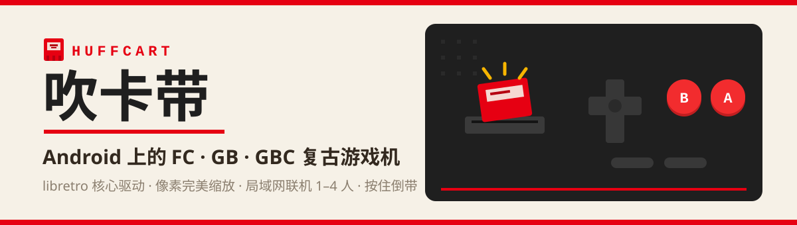
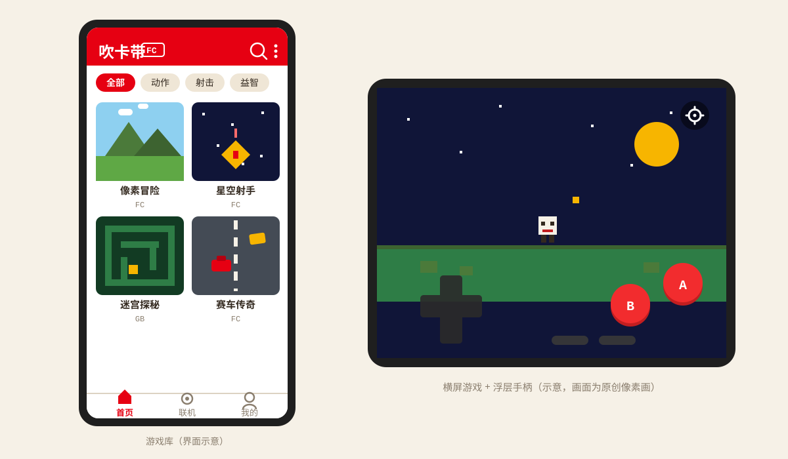

<div align="center">
  
  <br/>
  
</div>

**吹卡带(HuffCart)** 把你的 Android 手机变成一台童年的游戏机:插上卡带、吹一口气、按下 START。它是一个基于 libretro 架构的本地模拟器前端,支持 FC(NES)与 GB/GBC 掌机平台——游戏文件须由你自行提供。

<div align="center">
  
</div>

## 

- **三平台支持** — FC(NES)/GB/GBC,按 ROM 头部自动识别平台并选择核心(FCEUmm / Gambatte)
- **游玩体验** — 像素完美缩放(整数倍 / 4:3 / 拉伸)、横屏全屏沉浸、快进 1–3 倍、**按住倒带**(约 30 秒环形缓冲)、连发 A/B、断点续玩
- **存档** — 4 槽即时存档(带缩略图)+ 电池存档(SRAM)+ 退出自动挂起档
- **操作** — 虚拟手柄(十字键 / 摇杆两种形态,按压反馈)、蓝牙/USB 物理手柄(固定映射 + 键盘自定义 + 摇杆十字键)
- **音频** — 低延迟 / 平衡 / 稳定三档缓冲,快进与倒带自动静音
- **局域网联机 1–4 人** — NSD 自动发现 + 房间码 / 手输 IP,开局快照对齐,逐帧 CRC 失同步检测,断线无缝回单机
- **金手指** — Game Genie 码管理器(FC 平台)
- **游戏库** — 封面墙、分类、搜索、zip 压缩包批量导入、联网封面(libretro 图源,失败静默回退)、运行截图作封面
- **安全与隐私** — 零运行时权限、仅 3 个安装期权限;ROM、存档与截图不上云、不遥测

## 

1. 前往 [Releases](../../releases) 下载最新 APK(支持 Android 8.0 / API 26+)并安装。
2. 打开应用,点右上角菜单导入你的游戏文件(支持 `.nes` / `.gb` / `.gbc` 单文件或 zip 压缩包)。
3. 点封面开始游戏;横屏自动进入全屏沉浸 + 浮层手柄。
4. 想联机?两台设备连同一个 Wi-Fi:一方在「联机」页建房并选好游戏,另一方发现房间即可加入。

> ⚠️ **本应用不分发、不包含任何游戏 ROM。** 请仅使用你合法拥有的游戏文件;内置 ROM 仅限本地构建者自用,不会出现在公开发布物中。

## 

**前置**:JDK 17+、Android SDK + NDK/CMake、Git Bash(Windows 下运行脚本)。
**注意**:项目路径必须为**纯 ASCII**(NDK 工具链与单元测试类加载在含中文的路径下会失败)。Windows 推荐用 `subst` 映射盘:

```bat
subst H: "D:\path\to\huffcart"   :: 路径不含空格与中文
H:
```

```bash
# 1. 编译 libretro 核心(按版本锁从 libretro 上游构建,产物进 app/src/main/jniLibs)
scripts/build-core.sh            # 全部核心;也可 scripts/build-core.sh fceumm 单独构建

# 2. 构建 APK
./gradlew :app:assembleDebug     # 调试包
./gradlew :app:assembleRelease   # 发布包(无 keystore.properties 时自动回退 debug 签名)

# 3. 运行单元测试
./gradlew :app:testDebugUnitTest :core-bridge:test
```

可选(仅本地自用):把 FC ROM 目录同步进 assets 作内置游戏 —— `scripts/sync-bundled-roms.sh <ROM 目录>`。这些文件**不入 git、不进公开分发物**。

## 

- **签名说明**:v0.1.0 的 Release APK 以调试密钥签名 —— 这是构建脚本在缺少正式发布凭据时的显式回退(构建日志会输出警告),不影响安装,但请只从本仓库 Release 页获取安装包。
- **许可**:本项目以源码形式公开供学习交流,正式开源许可证将在后续版本确定;经 libretro 接口动态加载的第三方核心遵循其各自许可(FCEUmm、Gambatte 均为 GPL-2.0 及以上)。本项目不提供任何担保。
- **致谢**:感谢 [libretro](https://www.libretro.com/) 与其生态(FCEUmm、Gambatte)——吹卡带只是那台"主机"上的壳。

---

<div align="center">
  <sub>吹卡带 · 把童年装进口袋 🎮</sub>
</div>
